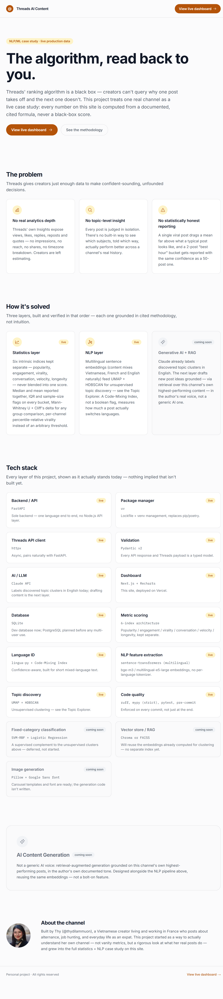
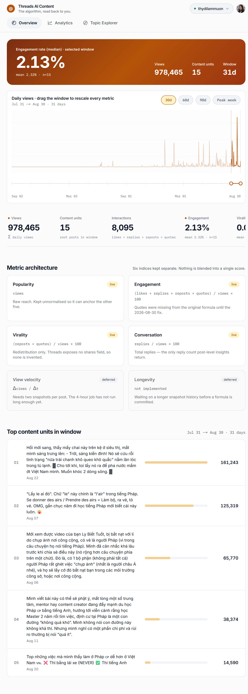
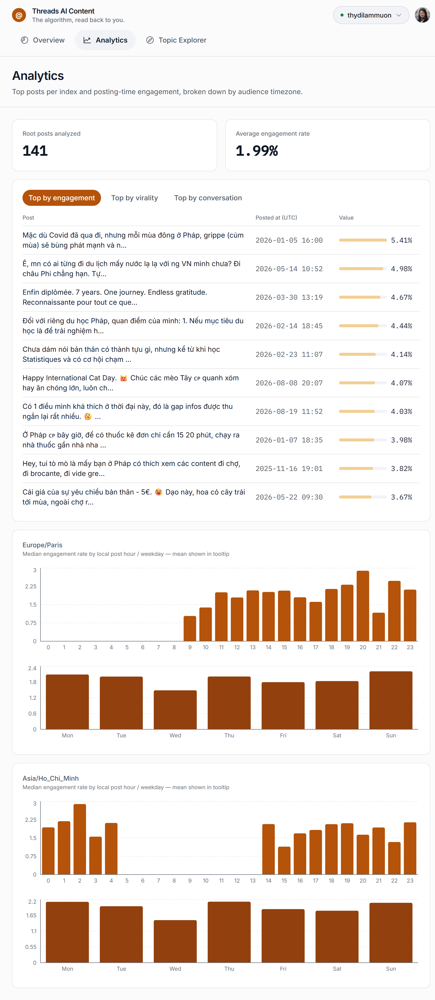
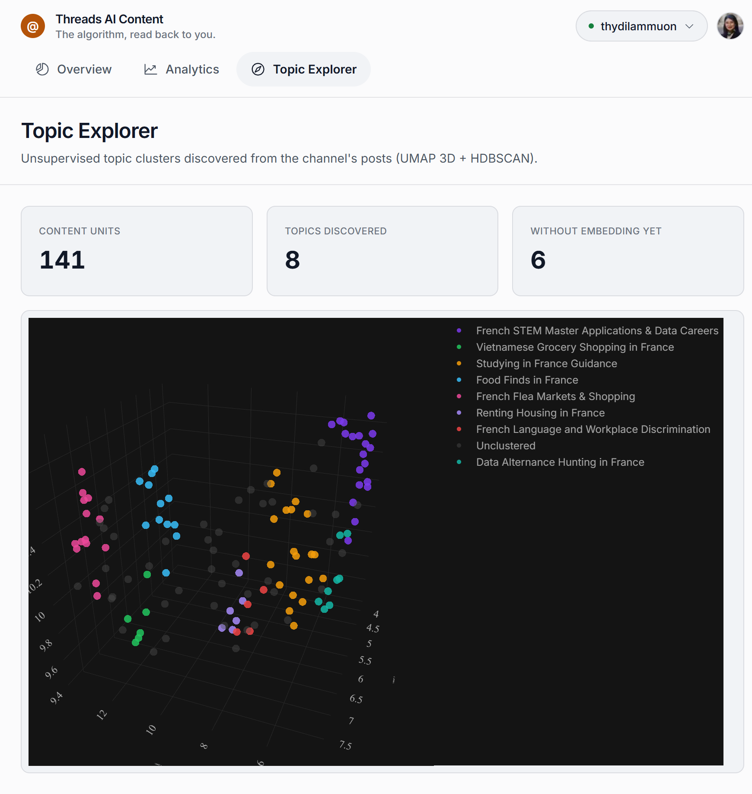

# Threads AI Content

**Language:** English · [Tiếng Việt](README.vi.md) · [Français](README.fr.md)


> The algorithm, read back to you.

Threads' ranking algorithm is a black box — creators can't query why one post takes off and the
next one doesn't. This project treats one real Threads channel, **[@thydilammuon](https://www.threads.net/@thydilammuon)**
(a Vietnamese creator living in France, posting about *alternance*, job hunting, and expat life),
as a live case study: every number on the dashboard is computed from a documented, cited formula —
never a black-box score.

It is a working **internal analytics + (eventually) content-generation tool** for that one channel,
built and open-sourced-in-spirit as an NLP/ML engineering portfolio piece. Not a SaaS, not
multi-tenant, not trying to be.

---

## Screenshots

The product in four steps — from the pitch to the raw discovered topics.

<p align="center">
  <br>
  <sub><b>1. Landing</b> — the pitch, the problem, and the three-layer solution (statistics → NLP → generative AI/RAG), plus the full tech stack shown live/coming-soon.</sub>
</p>

<p align="center">
  <br>
  <sub><b>2. Overview</b> — median-first KPI strip, the daily-views chart with the drag-to-rescale Timeline Brush, and the top content units in the selected window.</sub>
</p>

<p align="center">
  <br>
  <sub><b>3. Analytics</b> — top posts by engagement/virality/conversation, and posting-time performance broken down by both Europe/Paris and Asia/Ho_Chi_Minh.</sub>
</p>

<p align="center">
  <br>
  <sub><b>4. Topic Explorer</b> — unsupervised topic clusters (UMAP 3D + HDBSCAN) discovered from the channel's own post history.</sub>
</p>

---

## Table of contents

- [The problem](#the-problem)
- [How it's solved](#how-its-solved)
- [Tech stack](#tech-stack)
- [Architecture](#architecture)
- [Methodology highlights](#methodology-highlights)
- [Project status](#project-status)
- [Local setup](#local-setup)
- [About the channel](#about-the-channel)
- [License](#license)

---

## The problem

Threads gives creators just enough data to make confident-sounding, unfounded decisions.

- **No real analytics depth.** Threads' own Insights expose `views`, `likes`, `replies`, `reposts`
  and `quotes` — no impressions, no reach, no shares, no timezone breakdown. Creators are left
  estimating.
- **No topic-level insight.** Every post is judged in isolation. There's no built-in way to see
  which subjects, told which way, actually perform better across a channel's real history.
- **No statistically honest reporting.** A single viral post drags a mean far above what a typical
  post looks like, and a 2-post "best hour" bucket gets reported with the same confidence as a
  50-post one.

## How it's solved

Three layers, built and verified in that order — each grounded in cited methodology, not intuition.

| Layer | Status | What it does |
|---|---|---|
| **Statistics layer** | Live | Six intrinsic indices kept separate — popularity, engagement, virality, conversation, velocity, longevity — never blended into one score. Median and mean reported together (never a lone mean), IQR and sample-size flags on every bucket, Mann-Whitney U + Cliff's delta for any group comparison, per-channel percentile-relative virality instead of an arbitrary fixed threshold. |
| **NLP layer** | Live | Multilingual sentence embeddings (content mixes Vietnamese, French and English naturally, so no per-language tokenizer) feed UMAP + HDBSCAN for unsupervised topic discovery, then Claude labels each discovered cluster in English. A Code-Mixing Index — a continuous score, not a boolean flag — measures how much a post actually switches languages. |
| **Generative AI + RAG** | Coming soon | Claude already labels topic clusters. The next layer drafts new post ideas grounded — via retrieval over this channel's own highest-performing content — in the author's real documented voice, not a generic AI one. |

## Tech stack

Shown as it actually stands today — nothing implied that isn't built yet.

| Layer | Technology | Status |
|---|---|---|
| Backend / API | FastAPI | Live |
| Package manager | uv (`pyproject.toml` + `uv.lock`) | Live |
| Threads API client | httpx (async) | Live |
| Validation | Pydantic v2 | Live |
| AI / LLM | Claude API (`claude-opus-5`, cluster labeling + prompt caching) | Live |
| Dashboard | Next.js 16 + Tailwind v4 + Recharts | Live |
| Database | SQLite (dev) → PostgreSQL (planned before any multi-user use) | Live (dev) |
| Metric scoring | 6-index architecture (popularity/engagement/virality/conversation/velocity/longevity) | Live |
| Language ID | lingua-py + Code-Mixing Index | Live |
| NLP feature extraction | sentence-transformers, multilingual (bge-m3 / multilingual-e5-large) | Live |
| Topic discovery | UMAP + HDBSCAN (unsupervised clustering) | Live |
| Code quality | ruff (lint+format), mypy (strict), pytest, pre-commit | Live |
| Fixed-category classification | SVM-RBF + Logistic Regression | Coming soon |
| Vector store / RAG | Chroma or FAISS (reuses clustering embeddings) | Coming soon |
| Image generation | Pillow + Google Sans font (carousel templates ready, code isn't) | Coming soon |

## Architecture

```
threads-ai-content/
├── src/
│   ├── api/            Threads Graph API client (auth, pagination, caching) — live
│   ├── models/          ContentUnit / InsightSnapshot domain models — live
│   ├── processing/       thread reconstruction (root + self-reply chains), text cleaning — live
│   ├── analysis/         6-index metric scoring + windowed statistics (median/mean/IQR) — live
│   ├── nlp/              language ID, multilingual embeddings, UMAP+HDBSCAN clustering — live
│   ├── db/                SQLite schema (posts, content_units, insights_snapshots, topics) — live
│   ├── pipeline/           ingest, 4h snapshot cron, Windows↔WSL2 clustering bridge — live
│   ├── generation/         AI text generation via RAG — not started
│   ├── carousel/           Pillow-based carousel image composition — not started
│   ├── main.py             FastAPI entry point — live
│   └── dashboard/          Next.js app: landing page + Overview/Analytics/Topic Explorer — live
└── tests/                183 tests, ruff + mypy strict clean
```

Data flow, end to end:

```
Threads Graph API  ──(4h cron)──>  SQLite  ──>  FastAPI  ──>  Next.js dashboard
        │                              │
        └── posts, replies,            └── NLP pipeline (WSL2: embeddings, UMAP, HDBSCAN)
            account daily views            re-clusters daily, Claude labels clusters
```

The batch ML pipeline (embeddings, clustering) runs as a separate job that writes to SQLite —
FastAPI only ever reads precomputed results, it never loads a transformer model per request.

## Methodology highlights

A few decisions this project treats as load-bearing, documented in full in
[`docs/claude/architecture.md`](docs/claude/architecture.md) and
[`docs/claude/data-model.md`](docs/claude/data-model.md):

- **Median-as-headline, mean-as-secondary — never a pooled ratio.** A single windowed
  Σinteractions/Σviews ratio is dominated by whichever post got the most views; median across posts
  is reported first everywhere, with mean, sample size (`n`) and an IQR shown alongside it.
- **Six indices, never one blended score.** Popularity, engagement, virality, conversation,
  velocity and longevity answer different questions and are never averaged together into a single
  "score."
- **Every heuristic constant is either derived from real data or explicitly labeled as an
  uncalibrated hypothesis** — no unlabeled magic numbers.
- **Clustering space chosen by experiment, not by theory.** HDBSCAN was tried on both the raw
  1024-D embedding space and the UMAP-reduced space; raw-embedding space degenerated (one cluster
  absorbing 82% of the data), UMAP space produced stable, balanced clusters — the empirical result
  overrode the original design assumption. Full numbers in `data-model.md`.
- **Code-mixing is a continuous score, not a boolean.** Following the code-switching NLP
  literature, document-level language ID on short text is unreliable and shouldn't gate downstream
  pipeline steps — the Code-Mixing Index quantifies *how much* a post mixes languages instead of
  classifying it into one.

## Project status

**Phase 1 — analytics + content tool for one channel (in progress).** Threads API client, NLP
topic-discovery pipeline, 6-index metric architecture, windowed statistics, and a three-tab
dashboard (Overview, Analytics, Topic Explorer) plus this landing page are live against real
production data (183 tests passing, ruff + mypy strict clean). AI content generation
(`src/generation/`) and carousel image export (`src/carousel/`) are designed but not yet built.

**Phase 2 — Threads ecosystem research / "KOL Strategy Engine" (direction, not committed).**
Extending from one channel to cross-account pattern research would require Meta's Advanced Access
tier (Business Verification, App Review) that this project doesn't currently have or need for
Phase 1. No timeline or engineering effort is committed to this yet — see
[`CLAUDE.md`](CLAUDE.md) for the full reasoning.

## Local setup

```bash
# Backend (Python 3.12 via uv)
pip install --user uv
uv sync
cp .env.example .env               # fill in THREADS_* and ANTHROPIC_API_KEY
uv run pytest -q                   # 183 tests
uv run uvicorn src.main:app --reload --port 8000

# Dashboard (Next.js)
cd src/dashboard
npm install
npm run dev                        # http://localhost:3000
```

The dashboard reads live data from the FastAPI backend above — both need to be running locally to
see real numbers.

## About the channel

Built by Thy ([@thydilammuon](https://www.threads.net/@thydilammuon)), a Vietnamese creator living
and working in France who posts about *alternance*, job hunting, and everyday life as an expat.
This project started as a way to actually understand her own channel — not vanity metrics, but a
rigorous look at what her real posts do — and grew into the full statistics + NLP case study
described above.

## License

Private personal project. All rights reserved — not open source, not accepting external
contributions. Built as a portfolio piece demonstrating applied NLP/ML engineering on real
production data.
