
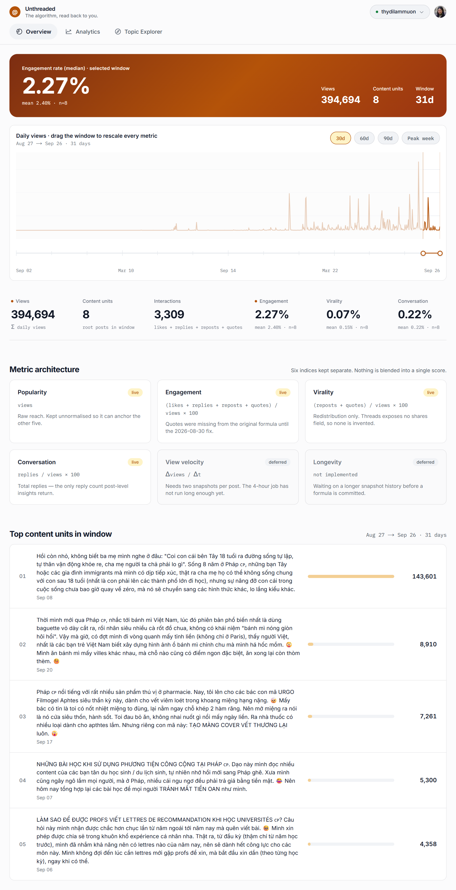
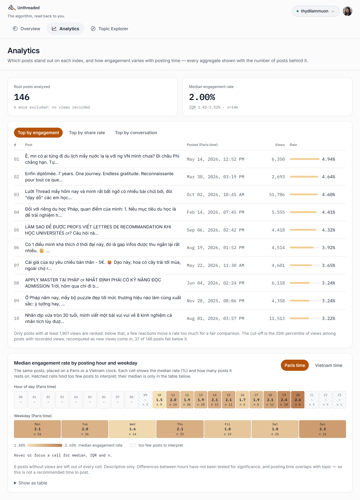
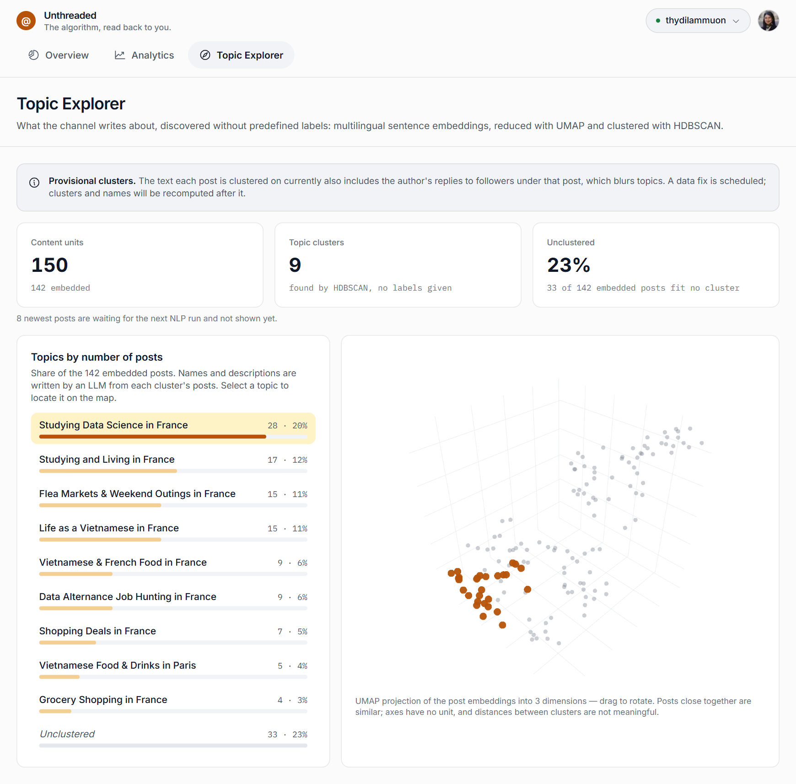

# Unthreaded

**Ngôn ngữ:** [English](README.md) · Tiếng Việt · [Français](README.fr.md)


> The algorithm, read back to you.
> (Thuật toán, được đọc ngược lại cho bạn.)

Thuật toán xếp hạng của Threads là một hộp đen — creator không có cách nào truy vấn tại sao bài này
"nổ" còn bài kia thì không. Dự án này chọn đúng 1 kênh Threads thật, **[@thydilammuon](https://www.threads.net/@thydilammuon)**
(một người Việt đang sống tại Pháp, chia sẻ về alternance, xin việc, và cuộc sống người Việt xa xứ),
làm case study thật: mọi con số trên dashboard đều được tính từ một công thức đã ghi chép rõ ràng,
có nguồn tham khảo — không bao giờ là một điểm số "hộp đen".

Đây là một **dự án phân tích + nghiên cứu NLP cho riêng 1 kênh**, hướng tới một **cơ sở tri thức
(knowledge base)** cập nhật liên tục về những gì kênh đã chia sẻ với follower — được xây dựng đồng thời làm sản phẩm portfolio cho vị trí NLP/ML
Engineer. Không phải SaaS, không multi-tenant, và không có tham vọng trở thành vậy.

---

## Ảnh chụp màn hình

Sản phẩm qua 4 bước — từ tuyên ngôn tới tận cluster chủ đề thô khám phá được.

<p align="center">
  <br>
  <sub><b>1. Landing</b> — một bài thật đặt cạnh chính kênh của nó (median, độ phân tán, n), 3 tầng (statistics → NLP → knowledge base) theo dấu bài đó, 2 panel dashboard trên dữ liệu thật, và pipeline từ Threads API tới trang, mỗi bước ghi đúng trạng thái thật.</sub>
</p>

<p align="center">
  <br>
  <sub><b>2. Overview</b> — KPI strip lấy median làm số chính, biểu đồ views theo ngày với Timeline Brush kéo-để-tính-lại, và danh sách content unit hiệu suất cao nhất trong cửa sổ đã chọn.</sub>
</p>

<p align="center">
  <br>
  <sub><b>3. Analytics</b> — top bài theo engagement/share rate/conversation, và hiệu suất theo giờ đăng tách riêng 2 múi giờ Europe/Paris và Asia/Ho_Chi_Minh.</sub>
</p>

<p align="center">
  <br>
  <sub><b>4. Topic Explorer</b> — cluster chủ đề khám phá không giám sát (UMAP 3D + HDBSCAN) từ chính lịch sử bài đăng của kênh.</sub>
</p>

---

## Mục lục

- [Vấn đề](#vấn-đề)
- [Giải pháp](#giải-pháp)
- [Tech stack](#tech-stack)
- [Kiến trúc](#kiến-trúc)
- [Điểm nhấn về methodology](#điểm-nhấn-về-methodology)
- [Trạng thái dự án](#trạng-thái-dự-án)
- [Chạy thử ở local](#chạy-thử-ở-local)
- [Về kênh](#về-kênh)
- [Giấy phép](#giấy-phép)

---

## Vấn đề

Threads chỉ cho creator đủ data để đưa ra quyết định *nghe có vẻ chắc chắn* nhưng thực ra không có
căn cứ.

- **Không có analytics đủ sâu.** Insights của Threads chỉ có `views`, `likes`, `replies`,
  `reposts`, `quotes` — không có impressions, không có reach, không có breakdown theo múi giờ.
  Creator chỉ còn cách đoán.
- **Không có insight ở cấp độ chủ đề.** Mỗi bài đăng được đánh giá độc lập. Không có cách nào sẵn
  có để thấy chủ đề nào, kể theo cách nào, thực sự hiệu quả hơn xuyên suốt lịch sử thật của kênh.
- **Báo cáo số liệu không trung thực về mặt thống kê.** 1 bài đột biến kéo mean lệch hẳn khỏi mức 1
  bài "bình thường" trông như thế nào, và 1 bucket "giờ đăng tốt nhất" chỉ có 2 bài lại được báo
  cáo với độ tự tin y hệt 1 bucket có 50 bài.

## Giải pháp

3 tầng, xây đúng theo thứ tự đó — mỗi tầng đều bám vào methodology có trích dẫn, không
phải cảm tính.

| Tầng | Trạng thái | Làm gì |
|---|---|---|
| **Statistics layer** | Đã có | 6 index tách biệt — popularity, engagement, share rate, conversation, velocity, longevity — không bao giờ gộp lại thành 1 điểm số duy nhất. Mỗi nhóm bài (1 topic, 1 khung giờ, 1 cửa sổ thời gian) hiện median, IQR (khoảng tứ phân vị: khoảng giá trị chứa 50% bài ở giữa) và số bài (n), kèm cờ khi n quá nhỏ để diễn giải. Tầng reach (qua API) đo so với mức gần đây của kênh (median của tối đa 20 bài trước), không theo 1 ngưỡng cố định tùy tiện. So sánh nhóm dùng kiểm định Brunner-Munzel hoán vị (kiểm định theo thứ hạng, không giả định 2 nhóm phân tán như nhau) và báo Cliff's delta, P(A > B) − P(A < B), kèm khoảng tin cậy 95%; p được hiệu chỉnh Holm trên từng họ phép so (với topic: mọi topic × engagement, share rate và conversation), khoảng tin cậy thì không. Job hằng ngày so mỗi topic với phần còn lại của kênh sau mỗi lần gom cụm, và trang landing hiện kết quả; trang Topics là bước tiếp theo. Bảng top bài chỉ xếp bài có views ít nhất bằng phân vị 25% của kênh, vì tỉ lệ đo trên ít views dao động quá mạnh để so. |
| **NLP layer** | Đã có | Embedding đa ngôn ngữ (content trộn tự nhiên VI/FR/EN nên không dùng tokenizer riêng cho 1 ngôn ngữ trước khi embed; từ khoá topic dùng bộ tách từ tiếng Việt) đưa vào UMAP + HDBSCAN để tự động khám phá chủ đề (unsupervised), sau đó Claude gán tên tiếng Anh cho từng cluster tìm được. Code-Mixing Index — một điểm số liên tục, không phải cờ boolean — đo mức độ 1 bài thực sự chuyển đổi ngôn ngữ. |
| **Knowledge base** | Tiếp theo | Bài đăng của kênh và câu trả lời của tác giả cho câu hỏi của follower, biến thành cơ sở tri thức tra cứu được: tìm kiếm hybrid (từ khoá BM25 + ngữ nghĩa) kèm reranker, được đo trên câu hỏi thật của follower (recall@k, MRR, nDCG) trước khi xây bất cứ thứ gì — như trợ lý hỏi đáp — lên trên. |

## Tech stack

Liệt kê đúng trạng thái thật của code hiện tại — không hứa hẹn tính năng chưa tồn tại.

| Layer | Công nghệ | Trạng thái |
|---|---|---|
| Backend / API | FastAPI | Đã có |
| Package manager | uv (`pyproject.toml` + `uv.lock`) | Đã có |
| Threads API client | httpx (async) | Đã có |
| Validation | Pydantic v2 | Đã có |
| AI / LLM | Claude API (`claude-sonnet-5-5`, gán tên cluster) | Đã có |
| Dashboard | Next.js 16 + Tailwind v4, chart SVG tự dựng + Plotly (bản đồ topic) | Đã có |
| Database | SQLite — 1 file, 1 tiến trình ghi; knowledge base cũng sẽ nằm trong đó | Đã có |
| Metric scoring | Kiến trúc 6 index (popularity/engagement/share rate/conversation/velocity/longevity) | Đã có |
| Language ID | lingua-py + Code-Mixing Index | Đã có |
| NLP feature extraction | sentence-transformers, đa ngôn ngữ (bge-m3 / multilingual-e5-large) | Đã có |
| Topic discovery | UMAP + HDBSCAN (clustering không giám sát) | Đã có |
| Code quality | ruff (lint+format), mypy (strict), pytest, pre-commit | Đã có |
| Fixed-category classification | SVM-RBF + Logistic Regression (bậc thang baseline so với cluster không giám sát) | Nghiên cứu, chưa bắt đầu |
| Knowledge base retrieval | SQLite FTS5 (BM25) + dense embedding + cross-encoder reranker | Tiếp theo |

## Kiến trúc

```
threads-ai-content/
├── src/
│   ├── api/            Client Threads Graph API (auth, pagination, caching) — đã có
│   ├── models/          Domain model ContentUnit / InsightSnapshot — đã có
│   ├── processing/       Ghép lại thread (root + chuỗi self-reply), làm sạch text — đã có
│   ├── analysis/         Metric 6-index + thống kê theo cửa sổ thời gian (median/IQR/n) — đã có
│   ├── nlp/              Language ID, embedding đa ngôn ngữ, clustering UMAP+HDBSCAN — đã có
│   ├── db/                Schema SQLite (posts, content_units, insights_snapshots, topics, embeddings, cluster_runs) — đã có
│   ├── pipeline/           Ingest, cron snapshot 4h, cầu nối clustering Windows↔WSL2 — đã có
│   ├── main.py             Entry point FastAPI — đã có
│   └── dashboard/          App Next.js: landing page + Overview/Analytics/Topic Explorer — đã có
└── tests/                bộ test pytest, ruff + mypy strict sạch
```

Luồng dữ liệu, từ đầu tới cuối:

```
Threads Graph API  ──(cron 4h)──>  SQLite  ──>  FastAPI  ──>  Dashboard Next.js
        │                              │
        └── posts, replies,            └── Pipeline NLP (WSL2: embedding, UMAP, HDBSCAN)
            views theo ngày                cluster lại mỗi ngày, Claude gán tên cluster
```

Pipeline ML batch (embedding, clustering) chạy như 1 job riêng, ghi kết quả vào SQLite — FastAPI
chỉ đọc kết quả đã tính sẵn, không bao giờ load model transformer mỗi request.

## Điểm nhấn về methodology

Một vài quyết định dự án coi là nền tảng, mỗi quyết định ghi thành 1 file tại
[`docs/decisions/`](docs/decisions/) và
[`docs/claude/data-model.md`](docs/claude/data-model.md):

- **Median làm số liệu chính — không tỉ lệ pooled, không hiện mean.** Một tỉ lệ Σinteractions/Σviews
  gộp cho cả cửa sổ bị chi phối bởi bài có views cao nhất, còn mean bị vài bài đột biến kéo lên. Mọi
  tỉ lệ đều mở đầu bằng median giữa các bài, kèm IQR và cỡ mẫu (`n`); API vẫn trả mean để phân
  tích.
- **6 index riêng biệt, không bao giờ gộp thành 1 điểm.** Popularity, engagement, share rate,
  conversation, velocity, longevity trả lời những câu hỏi khác nhau và không bao giờ bị trung bình
  hoá lại thành 1 "điểm số" duy nhất.
- **Mọi hằng số heuristic đều được suy ra từ data thật, hoặc ghi rõ là giả thuyết chưa calibrate**
  — không có con số "ma thuật" nào không ghi chú nguồn gốc.
- **Không gian clustering được chọn bằng thực nghiệm, không phải lý thuyết suông.** HDBSCAN được
  thử cả trên không gian embedding gốc 1024 chiều lẫn không gian đã giảm chiều bằng UMAP —
  embedding gốc bị suy biến (1 cluster chiếm 82% dữ liệu), không gian UMAP cho cluster ổn định và
  cân đối hơn — kết quả thực nghiệm ghi đè lên giả định thiết kế ban đầu. Số liệu đầy đủ tại
  `data-model.md`.
- **Code-mixing là 1 điểm số liên tục, không phải boolean.** Theo đúng literature NLP về
  code-switching, language ID ở cấp document trên văn bản ngắn không đáng tin cậy và không nên
  dùng để "gate" các bước xử lý phía sau — Code-Mixing Index đo *mức độ* 1 bài trộn ngôn ngữ thay
  vì phân loại nhị phân.

## Trạng thái dự án

**Đã có:** client Threads API, pipeline NLP khám phá chủ đề, kiến trúc metric 6-index, thống kê
theo cửa sổ thời gian, dashboard 3 tab (Overview, Analytics, Topic Explorer) cộng landing page này —
tất cả chạy thật trên data production (toàn bộ test pass, ruff + mypy strict sạch).

**Tiếp theo — phạm vi hẹp có chủ đích ("less is more"):**
1. Phân tích NLP sâu hơn, viết thành các câu hỏi nghiên cứu rõ ràng (độ ổn định cluster, so sánh
   model embedding, code-mixing vs engagement, bậc thang baseline cho bộ phân loại có giám sát).
2. Một cơ sở tri thức cập nhật liên tục, có đo chất lượng truy xuất.
3. Chỉ khi cơ sở tri thức đạt cổng chất lượng: trợ lý hỏi đáp dựa trên nó, cùng landing page
   thương hiệu cho kênh.

<!-- consistency: allow ADR0001-generation ADR0001-carousel ADR0001-image-gen -->
Generate bài theo giọng văn tác giả và generate ảnh carousel đã được cân nhắc và chủ động loại bỏ để
dự án giữ đúng trọng tâm.

## Chạy thử ở local

```bash
# Backend (Python 3.12 qua uv)
pip install --user uv
uv sync
uv run pre-commit install          # cổng chặn commit: lint, kiểu, nhất quán, test nhanh
cp .env.example .env               # điền THREADS_* và ANTHROPIC_API_KEY
uv run pytest -q                   # toàn bộ test (~1 phút)
uv run uvicorn src.main:app --reload --port 8000

# Dashboard (Next.js)
cd src/dashboard
npm install
npm run dev                        # http://localhost:3000
```

Dashboard đọc data thật từ backend FastAPI ở trên — cần chạy cả 2 cùng lúc mới thấy số liệu thật.

## Về kênh

Xây dựng bởi Thy ([@thydilammuon](https://www.threads.net/@thydilammuon)), một người Việt đang
sống và làm việc tại Pháp, chia sẻ về alternance, xin việc, và cuộc sống thường ngày của người Việt
xa xứ. Dự án bắt đầu như một cách để thực sự hiểu chính kênh của mình — không phải vanity metrics,
mà là một cái nhìn nghiêm túc về việc bài đăng thật của mình đang hoạt động ra sao — và phát triển
thành case study thống kê + NLP đầy đủ như mô tả ở trên.

## Giấy phép

Dự án cá nhân, private. Giữ toàn bộ quyền — không phải mã nguồn mở, không nhận contribution từ bên
ngoài. Được xây dựng làm sản phẩm portfolio, thể hiện năng lực kỹ thuật NLP/ML áp dụng thật trên
data production.

Không liên kết với Meta. Threads là nhãn hiệu của Meta Platforms, Inc. Repo vẫn giữ tên kỹ thuật
`threads-ai-content`.
